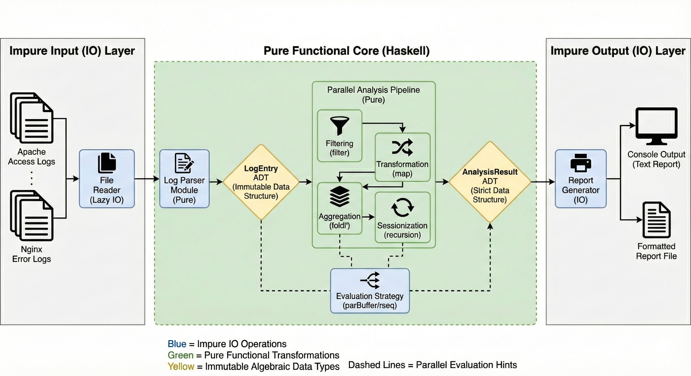

# Haskell Server Log Analyzer

> *A high-performance functional programming solution for web server log analysis*

## Project Information

**Project Title:** Enterprise Server Log Analyzer using Functional Programming
**Course:** Functional Programming Mini Project
**Technology Stack:** Haskell (GHC 9.x), Stack

### Group Members

- EG/2020/3990 - Jayasooriya LPM
- EG/2020/3994 - Jayathilake HACP
- EG/2020/3996 - Jayawardhana MVTI
- EG/2020/4040 - Lakpahana AGS

---

## [YouTube Demo]([https://](https://youtu.be/S7JR83tjYH4)https://)

## Problem Description

### Real-World Scenario

In modern web infrastructure, servers generate **millions of log entries daily**. These logs contain critical information about:

- Traffic patterns and user behavior
- Security threats (DDoS attacks, bot traffic)
- System errors and performance bottlenecks
- Resource utilization and bandwidth consumption

**Industrial Challenge:** Traditional log analysis tools often struggle with:

- Processing large volumes of data efficiently
- Maintaining data integrity during concurrent operations
- Providing reliable, reproducible results
- Ensuring code maintainability and testability

### Our Solution

We built a **pure functional log analyzer** in Haskell that demonstrates how FP principles solve these challenges through:

- **Purity & Immutability:** Predictable transformations with no side effects
- **Parallel Processing:** Safe concurrent computation without race conditions
- **Type Safety:** Compile-time guarantees preventing runtime errors
- **Composability:** Modular pipeline architecture for extensibility

---

## Quick Start

### Prerequisites

```bash
# Install Stack (Haskell build tool)
curl -sSL https://get.haskellstack.org/ | sh

# Or on macOS
brew install haskell-stack
```

### Installation & Execution

```bash
# 1. Clone or navigate to the project directory
cd haskell-log-analyzer

# 2. Build the project
stack build

# 3. Run with sample data
stack exec server-log-analyzer-exe data/sample.log

# 4. Or run with your own log file
stack exec server-log-analyzer-exe data/access.log

# 5. Interactive mode (prompts for file path)
stack exec server-log-analyzer-exe
```

### Alternative: Using GHCi (Interactive)

```bash
stack ghci

# Load main module
:load src/Main.hs

# Run analysis
main
# When prompted, enter: data/sample.log
```

---

## Sample Input/Output

### Sample Input Format

The analyzer processes **Apache/Nginx Combined Log Format**:

```
54.36.149.41 - - [22/Jan/2019:03:56:14 +0330] "GET /filter/test HTTP/1.1" 200 30577 "-" "Mozilla/5.0 (compatible; AhrefsBot/6.1)" "-"
31.56.96.51 - - [22/Jan/2019:03:56:16 +0330] "GET /image/60844/productModel/200x200 HTTP/1.1" 200 5667 "https://www.zanbil.ir/m/filter/b113" "Mozilla/5.0 (Linux; Android 6.0)" "-"
207.46.13.136 - - [22/Jan/2019:03:56:19 +0330] "GET /product/14926 HTTP/1.1" 404 33617 "-" "Mozilla/5.0 (compatible; bingbot/2.0)" "-"
```

### Sample Output

```
--- Haskell Log Analyzer ---
Enter path to log file (e.g., access.log): data/sample.log
Reading file: data/sample.log
Parsing logs...
Processing 20 log entries...

============================================
       LOG ANALYSIS REPORT
============================================
Total Lines Processed: 21
Successful Parses:     20
Failed Parses:         1
--------------------------------------------
Traffic by Status Category:
  Success         : 19
  ClientError     : 1

Top 10 IP Addresses:
  40.77.167.129   : 11 requests
  31.56.96.51     : 2 requests
  91.99.72.15     : 2 requests
  66.249.66.194   : 2 requests
  54.36.149.41    : 1 requests
  207.46.13.136   : 2 requests
  178.253.33.51   : 1 requests

Error Distribution (Hourly Buckets):
  2019-01-22 00:00:00 UTC : 1 errors
============================================

!!! ANOMALIES DETECTED !!!
  [ALERT] High traffic from IP 40.77.167.129: 11 requests
No specific anomalies detected.
```

---
## Architecture




## Project Structure

```
haskell-log-analyzer/
├── src/
│   ├── Main.hs           # Entry point & pipeline orchestration
│   ├── DataTypes.hs      # Algebraic Data Types & type definitions
│   ├── Parser.hs         # Pure parsing functions
│   ├── Processing.hs     # Core analysis algorithms with parallel processing
│   ├── IOHandler.hs      # Input/Output operations (IO boundary)
│   └── Utils.hs          # Helper utilities
├── data/
│   ├── sample.log        # Small test dataset (21 lines)
│   ├── server.log        # Medium dataset (~100KB)
│   └── access.log        # Large production dataset (~60MB)
├── test/                 # Unit and property tests
├── README.md             # This file
├── report.pdf            # Technical report
└── package.yaml          # Project dependencies
```

---

## Functional Programming Concepts Demonstrated

### 1. **Pure Functions**

All data transformations are pure (no side effects):

```haskell
-- Parser.hs: Pure transformation from String to structured data
parseLogLine :: String -> Maybe LogEntry
parseLogLine line = do
  -- Parsing logic using pattern matching and Maybe monad
  timestamp <- parseTimestamp timeStr
  method <- parseMethod methodStr
  return LogEntry {...}
```

**Benefit:** Predictable, testable, and cacheable results.

---

### 2. **Algebraic Data Types (ADTs)**

Strong type system models domain precisely:

```haskell
-- DataTypes.hs: Sum type for HTTP methods
data HttpMethod 
  = GET | POST | PUT | DELETE | HEAD | OPTIONS | PATCH 
  | UNKNOWN String
  deriving (Show, Eq, Ord)

-- Product type for log entries
data LogEntry = LogEntry
  { leIpAddress    :: String
  , leTimestamp    :: UTCTime
  , leMethod       :: HttpMethod
  , leStatusCode   :: Int
  , leResponseSize :: Int
  -- ... more fields
  } deriving (Show, Eq)
```

**Benefit:** Compile-time validation prevents invalid states.

---

### 3. **Higher-Order Functions**

Functions as first-class values enable composition:

```haskell
-- Processing.hs: Generic aggregator accepting a function
requestsPerEndpoint :: (LogEntry -> Maybe String) -> [LogEntry] -> Map String Int
requestsPerEndpoint extractor = foldl' aggregate M.empty
  where
    aggregate acc entry = case extractor entry of
      Just endpoint -> M.insertWith (+) endpoint 1 acc
      Nothing -> acc
```

**Benefit:** Reusable abstractions reduce code duplication.

---

### 4. **Recursion & Tail Recursion**

Natural iteration through recursive patterns:

```haskell
-- Processing.hs: Session splitting using recursion
splitSessions :: [LogEntry] -> [[LogEntry]]
splitSessions [] = []
splitSessions (x:xs) = go [x] xs
  where
    go currentSession [] = [reverse currentSession]
    go currentSession@(latest:_) (next:rest)
      | gap > timeout = reverse currentSession : go [next] rest
      | otherwise     = go (next:currentSession) rest
      where
        gap = diffUTCTime (leTimestamp next) (leTimestamp latest)
```

**Benefit:** Clear logic without mutable loop variables.

---

### 5. **Lazy Evaluation**

Process infinite or large datasets efficiently:

```haskell
-- Parser.hs: Only parses lines as needed
parseLogFile :: String -> [LogEntry]
parseLogFile content = 
  [entry | Just entry <- map parseLogLine (lines content)]
```

**Benefit:** Memory-efficient streaming of large log files.

---

### 6. **Immutability**

No mutable state ensures thread safety:

```haskell
-- Processing.hs: Building result without mutation
countByLevel :: [LogEntry] -> Map StatusCategory Int
countByLevel = foldl' countEntry M.empty
  where
    countEntry acc entry =
      let category = statusCategory (leStatusCode entry)
      in M.insertWith (+) category 1 acc  -- Creates new map
```

**Benefit:** Eliminates entire class of concurrency bugs.

---

### 7. **Parallel & Concurrent Processing**

Safe parallelism without locks:

```haskell
-- Processing.hs: Parallel session processing
sessionize :: NominalDiffTime -> [LogEntry] -> [[LogEntry]]
sessionize timeout entries =
  concatMap sessionizeIP groupedByIP `using` parBuffer 100 rseq
```

**Benefit:** Automatic parallelization with referential transparency.

---

### 8. **Monads (Maybe, IO)**

Composable error handling and effect management:

```haskell
-- Parser.hs: Chaining fallible operations with Maybe monad
parseLogLine line = do
  timestamp <- parseTimestamp timeStr  -- Fails gracefully
  method <- parseMethod methodStr
  status <- readMaybe statusStr
  return LogEntry {...}
```

**Benefit:** Eliminates null pointer exceptions and exception handling clutter.

---

### 9. **Functional Pipeline Architecture**

Separation of concerns (IO boundary vs pure logic):

```haskell
-- Main.hs: Clear data flow pipeline
main :: IO ()
main = do
  filePath <- getFilePath              -- IO: User interaction
  content <- readLogFile filePath      -- IO: Read file
  
  let entries = parseLogFile content   -- Pure: Parse
  let result = processLogs entries     -- Pure: Transform
  let anomalies = computeAnomalies entries  -- Pure: Analyze
  
  writeReport result                   -- IO: Output
```

**Benefit:** Testable core logic isolated from effects.

---

### 10. **Type-Driven Development**

Type signatures as documentation:

```haskell
-- Processing.hs: Self-documenting function signatures
topIPs :: Int -> [LogEntry] -> [(String, Int)]
errorsOverTime :: NominalDiffTime -> [LogEntry] -> [(UTCTime, Int)]
sessionize :: NominalDiffTime -> [LogEntry] -> [[LogEntry]]
```

**Benefit:** Compiler enforces correctness; types guide implementation.

---

## Industrial Relevance

### DevOps & Site Reliability Engineering (SRE)

- **Real-time monitoring:** Detect traffic spikes, error patterns, and anomalies
- **Capacity planning:** Analyze bandwidth usage and resource consumption
- **Incident response:** Quick identification of error sources and affected IPs

### Security & Threat Detection

- **DDoS Detection:** Identify abnormal traffic patterns from specific IPs
- **Bot Classification:** Distinguish between legitimate crawlers and malicious bots
- **Attack Pattern Analysis:** Track 404 errors indicating scanning attempts

### Business Intelligence

- **User Behavior:** Analyze popular endpoints and referrer sources
- **Performance Metrics:** Response size distribution and error rates
- **Traffic Trends:** Hourly/daily patterns for infrastructure optimization

### Why Functional Programming Wins Here

1. **Reliability:** Pure functions guarantee reproducible reports for compliance
2. **Concurrency:** Process millions of logs in parallel without race conditions
3. **Correctness:** Type system prevents entire categories of bugs
4. **Maintainability:** Composable functions enable easy feature additions
5. **Performance:** Lazy evaluation + parallelism = efficient resource utilization

---

## Testing

```bash
# Run all tests
stack test

# Run specific test suite
stack test :server-log-analyzer-test

# Run with coverage
stack test --coverage
```

**Test Coverage:**

- Unit tests for parsing functions
- Property-based tests with QuickCheck
- Integration tests with real log samples

---

## Dependencies

Core libraries used:

- `time` - Date/time parsing and manipulation
- `containers` - Efficient Map and Set implementations
- `regex-tdfa` - Regular expression matching for parsing
- `parallel` - Parallel evaluation strategies
- `deepseq` - Forcing full evaluation for parallelism

---

## Additional Resources

- **Haskell Documentation:** [haskell.org](https://www.haskell.org/)
- **Learn You a Haskell:** [learnyouahaskell.com](http://learnyouahaskell.com/)
- **Apache Log Format:** [httpd.apache.org/docs/current/logs.html](https://httpd.apache.org/docs/current/logs.html)
- **DataSet:** [web-server-access-logs](https://www.kaggle.com/datasets/eliasdabbas/web-server-access-logs)

---

## License

This project is created for academic purposes as part of a Functional Programming course assignment.

---
